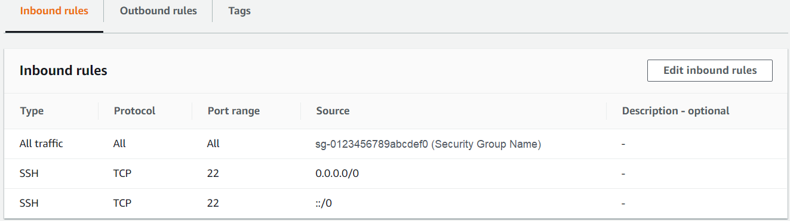
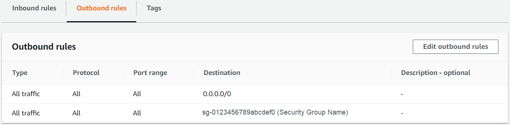
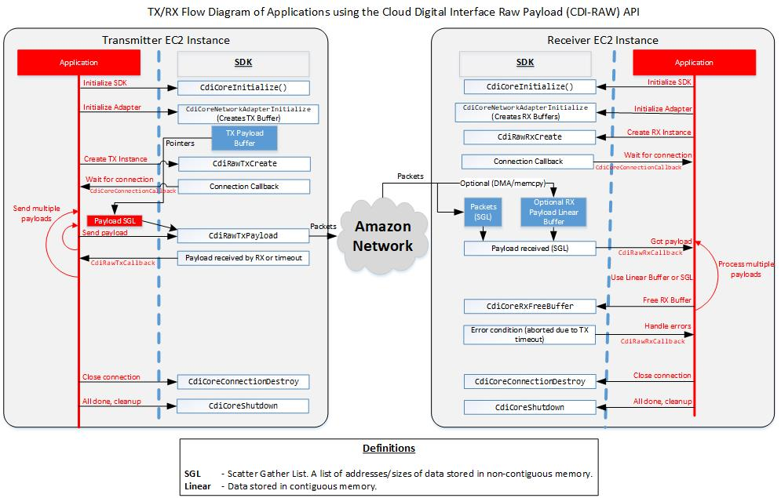

# AWS CDI SDK

The AWS Cloud Digital Interface (CDI) Software Development Kit (SDK) is a set of libraries and documentation for you to build live video solutions on AWS. The AWS CDI SDK provides access to the network performance, reliability, and uncompressed video capabilities required to build applications including TV channel playout, live video production switching, motion graphic insertion, multi-viewers, video frame rate and color space conversion, forensic watermarking, and video decoding and encoding. If you are developing a distributed live video application that runs across multiple compute instances, integrating the AWS CDI SDK into your software application can give you the tools and performance you need. The AWS CDI SDK contains libraries that can be easily integrated into your application.

---

- [AWS CDI SDK](#aws-cdi-sdk)
- [Glossary](#glossary)
- [Overview](#overview)
  - [Features](#features)
  - [Technical details](#technical-details)
  - [Related technology](#related-technology)
- [Installation](#installation)
  - [Create an AWS account](#create-an-aws-account)
  - [Create an EFA-enabled instance](#create-an-efa-enabled-instance)
  - [Additional OS-dependent steps](#additional-os-dependent-steps)
  - [Creating additional instances](#creating-additional-instances)
  - [Browse the HTML documentation](#browse-the-html-documentation)
- [Using the AWS CDI SDK test applications](#using-the-aws-cdi-sdk-test-applications)
- [Using AWS CDI SDK in an application](#using-aws-cdi-sdk-in-an-application)
  - [High level overview](#high-level-overview)
  - [Application programming interface](#application-programming-interface)
    - [Documentation](#documentation)
    - [Includes](#includes)
    - [Libraries](#libraries)
  - [Example test applications](#example-test-applications)
  - [Performance metrics in the AWS CDI SDK](#performance-metrics-in-the-aws-cdi-sdk)
    - [IAM permissions required by the compute instance](#iam-permissions-required-by-the-compute-instance)
    - [Customer option to disable the collection of performance metrics by the AWS CDI SDK](#customer-option-to-disable-the-collection-of-performance-metrics-by-the-aws-cdi-sdk)
    - [Learn more](#learn-more)
- [Known issues, limitations and performance](#known-issues-limitations-and-performance)
  - [Known issues](#known-issues)
  - [Known limitations](#known-limitations)
  - [Performance](#performance)
    - [AWS CDI SDK CPU usage](#aws-cdi-sdk-cpu-usage)
    - [Other performance considerations](#other-performance-considerations)
- [Troubleshooting](#troubleshooting)
  - [Transmitter and receiver failing to communicate](#transmitter-and-receiver-failing-to-communicate)
  - [Communication failure and firewall settings](#communication-failure-and-firewall-settings)
- [Security](#security)
- [Licensing](#licensing)
- [Issues](#issues)

---

# Glossary

**Amazon EC2** - *Amazon Elastic Compute Cloud.*

**EFA** - *Elastic Fabric Adapter (EFA) is a network interface for Amazon EC2 instances that enables customers to run applications requiring high levels of inter-node communications at scale on AWS.*

**IAM** - *AWS Identity and Access Management (IAM) enables you to manage access to AWS services and resources securely. Using IAM, you can create and manage AWS users and groups, and use permissions to allow and deny their access to AWS resources.*

**Placement Group** - *Placement groups influence the placement of a group of interdependent instances to meet the needs of your workload.*

**Security Group** - *A security group acts as a virtual firewall for your instance to control inbound and outbound traffic. When you launch an instance in a VPC, you can assign up to five security groups to the instance.*

**SGL** - *Scatter-Gather List, a list of addresses/data sizes stored in non-contiguous memory.*

**SRD** - *Scalable Reliable Datagram (SRD) enhances the performance of inter-instance communications by providing reliable packet delivery.*

**VPC** - *Virtual Private Cloud (Amazon VPC) lets you provision a logically isolated section of the AWS Cloud where you can launch AWS resources in a virtual network that you define. You have complete control over your virtual networking environment, including selection of your own IP address range, creation of subnets, and configuration of route tables and network gateways.*

---

# Overview

For time-sensitive data transmission of uncompressed live video, latency and quality must be optimized.  Historically this type of video workload was built on-premises using Serial Digital Interface (SDI) connections or with dedicated IP networks.

The AWS CDI SDK is designed to enable you to deploy live uncompressed video solutions in the AWS Cloud through the reliable transmission of blocks of data between Elastic Fabric Adapter (EFA) enabled Amazon EC2 instances.

This SDK provides an Audio/Video/Metadata (AVM) API to send video data between instances, and a RAW (data is not interpreted in any way) API to send generic data. The AVM API allows you to easily map SMPTE ST-2110 video over IP streams to the AWS CDI SDK for transport.

The [Installation](#installation) section of this document will help you get started using the AWS CDI SDK.

## Features

* Transfers data between EC2 instances. This includes data of any format: raw packetized video, audio, ancillary data, frame buffers, or compressed data.
* Schedules and sends packetized streams to remote hosts designed for high reliability for transfer of data using Scalable Reliable Datagram (SRD).
* A single instance of the AWS CDI SDK supports multiple transmitters and receivers.

## Technical details

The implementation for this transit occurs over the Scalable Reliable Datagram (SRD) protocol. To achieve the highest performance and lowest latency, the AWS CDI SDK relies on EC2 instances that support the [Elastic Fabric Adapter (EFA)](http://aws.amazon.com/hpc/efa/) and are placed within a single Placement Group.

The AWS CDI SDK opens one specified User Datagram Protocol (UDP) port per connection to control communication between Amazon EC2 instances running AWS CDI SDK. The receiving side listens on the specified port number. The transmitting side uses a random port number from the ephemeral port range, as determined by the operating system.

For network security best practices concerning how to block UDP packets from the public Internet, see [Security best practices for your VPC](https://docs.aws.amazon.com/vpc/latest/userguide/vpc-security-best-practices.html).

The AWS CDI SDK also relies on EC2 instances using a Security Group that allows all inbound and outbound traffic to and from the Security Group itself. For more information, see [Prepare an EFA-Enabled Security Group](https://docs.aws.amazon.com/AWSEC2/latest/UserGuide/efa-start.html#efa-start-security).

## Related technology

In addition to Amazon's EFA and SRD technology described above, your implementation of the AWS CDI SDK may also involve:

* [libfabric](https://github.com/ofiwg/libfabric) by [OpenFabrics](https://ofiwg.github.io/libfabric/).
* [EFA driver for Windows](./INSTALL_GUIDE_WINDOWS.md#install-the-windows-efa-driver) (available via AWS S3 Bucket).
* [AWS CLI version 2](https://docs.aws.amazon.com/cli/latest/userguide/install-cliv2.html)
* [PDCurses](https://pdcurses.org/) in Windows.

Instructions are provided in the documentation below for installing these packages, some of which is published by third parties. If you elect to download and/or use this content, you may be subject to additional terms and conditions. Amazon is not the distributor of content you elect to download from third party sources, and expressly disclaims all liability with respect to such content.

---

# Installation

## Create an AWS account

1. [Create an AWS account](http://aws.amazon.com/premiumsupport/knowledge-center/create-and-activate-aws-account/). Skip this step if you already have an AWS account.
1. [Get started with EC2](http://docs.aws.amazon.com/AWSEC2/latest/UserGuide/get-set-up-for-amazon-ec2.html), which includes setting up an Identity and Access Management role (IAM), a key pair, a Virtual Private Cloud (VPC), and a Security Group, among other things.

## Create an EFA-enabled instance

Follow these instructions to create an EFA-enabled EC2 instance.

**Note**: When launching a Linux instance, choosing **Amazon Linux 2 (AL2)** is recommended because it is optimized for running on EC2 and is the primary Linux distribution used for the majority of CDI development and testing. When launching a Windows instance, choose **Windows Server 2019**.
To launch an EFA-enabled instance, follow the prepare and launch steps in the [launch an EFA-capable instance](http://docs.aws.amazon.com/AWSEC2/latest/UserGuide/efa-start.html) guide, with the additions described below. Refer to the [Install Guide Linux](INSTALL_GUIDE_LINUX.md) and [Install Guide Windows](INSTALL_GUIDE_WINDOWS.md) for additional information on installing EFA software and the AWS CDI SDK.

1. During step **Prepare an EFA-enabled security group**, when configuring **Inbound rules**, edit the settings for your newly created “EFA” security group.
    1. Select **Actions->Edit inbound security rules**
        * Select **Add Rule**
        * Under **type** select **All traffic**.
        * Under **source** select **Custom**.
        * In the field next to **Custom**, start typing **sg** and a dropdown list of your security groups will appear. Select the security group you made for EFA.
        * Select **Add rule**.
        * Under **type** select **SSH**.
        * Under **source**, select **Anywhere**.
        * Select **Save Rules**.
        * Below is an example of the inbound rules for a correctly configured security group.

        

          **Note**: For Windows instances, an additional inbound rule is needed to enable Remote Desktop Protocol (RDP) connections:
        * Select **Add rule**.
        * Under **type** select **RDP**.
        * Under **source**, select **Anywhere**.
        * Click **Save Rules**.
    2. Select **Actions->Edit outbound security rules**
        * Select **Add rule**.
        * Under **type** select **All traffic**.
        * Under **source** select **Custom**.
        * In the field next to **Custom**, start typing **sg** and a dropdown list of your security groups will appear. Select the security group you made for EFA.
        * Select **Save Rules**.
        * This is an example of the outbound rules for a correctly configured security group:

        
2. During step **Launch a temporary instance** under **Configure Instance Details**:
    1. Choose a VPC. AWS provides default VPCs for all accounts for all regions, but you may create a new VPC for this exercise. For more information on how to create a vpc, see [Virtual Private Clouds](https://docs.aws.amazon.com/AWSEC2/latest/UserGuide/using-vpc.html). If you don’t already have a subnet for the chosen VPC, you can select **Create new subnet** on this page.
    1. If access to this instance from outside the Amazon network is needed, enable **Auto-assign public IP.**
    1. Make sure to enable EFA by checking the **Elastic Fabric Adapter** checkbox here. **Note**: To enable the checkbox, you must select the subnet even if using the default subnet value.
    1. Amazon recommends putting EFA-enabled instances using AWS CDI SDK in a placement group, so select or create one under **Placement Group – Add instance to placement group.**  The **Placement Group Strategy** should be set to **cluster**.

## Additional OS-dependent steps

Depending on your operating system, follow the AWS CDI SDK installation instructions for [Linux](./INSTALL_GUIDE_LINUX.md) or [Windows](./INSTALL_GUIDE_WINDOWS.md).

## Creating additional instances

In order to use AWS CDI SDK in an application, two instances are needed.
To create an additional instance:

  1. Select the previous instance in the EC2 console, and then select **Launch More Like This** in the **Action** menu.
  1. Perform the [OS-Dependent steps above](#additional-os-dependent-steps).
  1. This instance will now be considered the receiver.

## Browse the HTML documentation

The HTML documentation provides a complete overview for using the AWS CDI SDK.
Documentation builds during installation and can be rebuilt any time using these [Linux](./INSTALL_GUIDE_LINUX.md#build-the-html-documentation) or [Windows](./INSTALL_GUIDE_WINDOWS.md#build-the-html-documentation) instructions.
Once built, the HTML documentation will be located at aws-cdi-sdk/build/documentation/index.html.

---

# Using the AWS CDI SDK test applications

The AWS CDI SDK comes with test applications for confirming correct installation as well as providing example usage to assist with application development. Please see the [Test Application User Guide](./USER_GUIDE_TEST_APP.md) for details.

---

# Using AWS CDI SDK in an application

## High level overview

An application uses AWS CDI SDK API’s to create transmitter instances to send payloads or receiver instances to receive payloads. Here is a diagram of the program flow:



## Application programming interface

### Documentation

The API documentation can be found in the [HTML Documentation](#browse-the-html-documentation).

### Includes

Includes can be found at the following paths:

* aws-cdi-sdk/include
* aws-cdi-sdk/src/common/include

### Libraries

After the libraries have been built, library locations that are referenced by aws-cdi-sdk can be found at the following paths:

1. Linux:
    1. libfabric.so.x: build/debug|release/lib
    1. libcdisdk.so.x.x: build/debug|release/lib
1. Windows:
    1. proj/x64/Debug/cdi_sdk.lib

## Example test applications

* The source code for the test application, ```cdi_test```, is located at ```aws-cdi-sdk/src/test```.
* The source code used to create the minimal test applications, ```cdi_test_min_tx``` and ```cdi_test_min_rx```, can be used as simplified usage examples. The source code is located at ```aws-cdi-sdk/src/test_minimal```.
* Example usage of the SDK can be found in the [test applications](USER_GUIDE_TEST_APP.md).

## Performance metrics in the AWS CDI SDK

At AWS, we develop and launch products and services based on interactions with customers. We use customer feedback to iterate on our offerings. We also collect and use performance metrics to help us to better understand our customers’ needs, diagnose and fix issues, and deliver features that improve the customer experience.

When you integrate the AWS CDI SDK into your video applications running on Amazon EC2, the SDK collects related performance metrics about the network traffic such as signal latency, round-trip times, late or dropped frames, errors, and AWS Account IDs (when available). The AWS CDI SDK does not collect your network traffic content, such as the video or audio content you transfer.

### IAM permissions required by the compute instance

In order for the AWS CDI SDK to be able to connect to the performance metrics service, the instance on which it is running must be assigned an IAM role with at least the ```mediaconnect:PutMetricGroups``` permission.

**Note**: This may result in an IAM warning such as: ```IAM does not recognize one or more actions. The action name might include a typo or might be part of a previewed or custom service```, which can be safely ignored.

### Customer option to disable the collection of performance metrics by the AWS CDI SDK

Customers control whether to allow the collection of performance metrics by the AWS CDI SDK, and can change their settings at any time. AWS uses the metrics collected by the SDK to help improve the quality of its products and services. The metrics can also assist AWS Support in diagnosing specific issues that AWS customers may encounter when integrating the SDK into EC2 workloads.

Should you choose to, you can disable performance metric collection by the AWS CDI SDK by making the changes below to sections of the source code.

- In the file ```src/cdi/configuration.h```, comment out ```#define METRICS_GATHERING_SERVICE_ENABLED```.

**Note**: For the change to take effect, the CDI SDK library and related applications must be rebuilt.

If you do not make these changes, collection of performance metrics remains enabled and occurs in the background without requiring any additional interaction.

Separately, customers can also configure the AWS CDI SDK to collect performance metrics to be displayed within their own Amazon CloudWatch account. Instructions to enable and disable the Amazon CloudWatch display are available in the [Linux](./INSTALL_GUIDE_LINUX.md#disabling-the-display-of-performance-metrics-to-your-amazon-cloudwatch-account) and [Windows](./INSTALL_GUIDE_WINDOWS.md#disabling-the-display-of-performance-metrics-to-your-amazon-cloudwatch-account) installation guides.

### CDI Between Shared Instances in Shared Subnets
CDI can be sent between EC2 instances belonging to different VPCs, but located in the same subnet [shared between the accounts using Resource Access Manager](https://docs.aws.amazon.com/vpc/latest/userguide/example-vpc-share.html).  In this case, in addition to the usual EFA-enabled security group requirements, each EC2 instance security group must also have inbound and outbound rules allowing "all traffic" with source or destination of the EFA-enabled security group of the other VPC, referenced with "account/SG" notation.

### Learn more

For more information about how AWS protects data privacy, please see [AWS’s Data Privacy FAQs](https://aws.amazon.com/compliance/data-privacy-faq/).

---

# Known issues, limitations and performance

Community reported issues may be found [here](https://github.com/aws/aws-cdi-sdk/issues).

## Known issues

* The maximum data rate supported is approximately 12 Gbps per stream and has been tested with an aggregate of up to 50 Gbps across all streams, in either direction. This assumes the largest size instance that supports EFA, for example, c5n.18xlarge.
* Windows compilation of the ```cdi_test``` application under the *Debug* configuration does not support 4K bandwidth.

## Known limitations

* Payload frame rates have been tested up to 60 FPS.
* The maximum payload size tested is 20736000 bytes allowing a 4k video (3840x2160) at 60 frames per second and 3 bytes per pixel.

## Performance

The best performance for transferring data between instances is *within a **cluster** placement group*. You can use placement groups to influence the placement of a group of interdependent instances to meet the needs of your workload.

### AWS CDI SDK CPU usage

When using the EFA, a user space poll mode network driver is employed. Each receive connection uses a thread that is dedicated to constantly polling the network interface for received packets and processing them when they arrive. A similar thread is used on the transmit side. This thread is put to sleep when no transmitted packets are awaiting acknowledgment of receipt by the receiving end. The thread used by the connection can be either dedicated or shared with other connections as specified at connection creation time. On Linux-based platforms, the CPU core dedicated to running the threads can also be specified. In this case, the operating system should be set up to prevent other processes from being scheduled on the cores.

Note that when using a shared thread that contains both transmit and receive connections the thread will be constantly running in order to process the receive connections.

When using a thread dedicated to a single connection, general guidance is that receiving a 2160p60 stream (20736000 bytes per frame) consumes approximately 80% of a CPU core while 1080p60 requires about 20%. The load scales roughly linearly with the number of packets processed. Therefore, 2160p60 should be about four times that of 1080p60.

The AWS CDI SDK has other threads running besides the poll threads to perform processing, such as packetization and execution of application callback functions.

### Other performance considerations

The network driver imposes a limit on the number of scatter gather list (SGL) entries per packet. As a result, the best performance is achieved if the size of SGL entries passed into the AWS CDI API is at least one third the size of the largest network packet size. This works out to be approximately 3 kB per SGL entry. Smaller SGL entries are supported, but will require additional network packets.

Debug builds add additional run-time overhead as determined by the compiler. The best performance is achieved using release builds.

---

# Troubleshooting

These are some common issues you might encounter when testing AWS CDI SDK.

## Transmitter and receiver failing to communicate

If there is a problem with the transmitter and receiver communication, it can manifest in some of the following ways:

* For EFA tests, the console output repeatedly logging the following lines and then eventually timing out:

```bash
[ProbeTxControlProcessProbeMode:234] Probe Tx mode[SendReset]
[ProbeControlSendCommand:220] Probe Tx sending command[Reset] to Rx. packet_num[20] ack[1]
```

* For socket (non-EFA) tests, the console output gets stuck at the following line without showing a running count of the packets received:

```bash
[RxCreateInternal:343] Successfully created Rx connection. Name[Rx_0]
```

* For ```fi_pingpong``` via ```efa_test.sh``` test, if returned exit code is non-zero, such as ```test returned 5``` or ```prov_error 13```:

```bash
$ ./efa_test.sh
Starting server...
Starting client...
[error] .../libfabric/util/pingpong.c:1063: cq_readerr: unknown error
Error: fi_pingpong test returned 5.

# increase FI log verbosity by setting ENV VAR and executing efa_test.sh again:
export FI_LOG_LEVEL=warn

$ ./efa_test.sh
Starting server...
Starting client...
libfabric:1428:core:core:fi_getinfo_():962<warn> fi_getinfo: provider ofi_rxm returned -61 (No data available)
libfabric:1428:ofi_mrail:fabric:mrail_get_core_info():288<warn> OFI_MRAIL_ADDR_STRC env variable not set!
libfabric:1428:core:core:fi_getinfo_():962<warn> fi_getinfo: provider ofi_mrail returned -61 (No data available)
libfabric:1428:core:mr:ofi_uffd_init():346<warn> syscall/userfaultfd Operation not permitted
libfabric:1428:efa:cq:rxr_cq_handle_cq_error():341<warn> fi_cq_readerr: err: Input/output error (5), prov_err: unknown error (13)
libfabric:1428:efa:cq:rxr_cq_handle_tx_error():215<warn> rxr_cq_handle_tx_error: err: 5, prov_err: Unknown error -13 (13)
[error] .../libfabric/util/pingpong.c:1063: cq_readerr: unknown error
Error: fi_pingpong test returned 5.
```

If any of these issues occurs, check your firewall settings. There are three different locations where the packets could be filtered: EC2 Security Groups, VPC Network Access Control Lists (ACLs), or a firewall on the Linux or Windows instance itself.

**Critical**
> Ensure the EC2 Security Group allows **all traffic** for both inbound and outbound traffic to and from the Security Group itself.

For socket-based communication and for the control ports for EFA-based communication, make sure that UDP traffic is allowed to access that port from the instance you are sending from. The easiest way to ensure this is to use the same security group on all EC2 instances that you have communicating with each other, and then make sure to use private IPv4 addresses instead of public ones. If you use public IP addresses, you may need to add explicit entries for any IP addresses that you want to allow traffic from. Note that for the control ports for EFA, there is bidirectional communication between the instances, so make sure that the transmitter and receiver instances have ports open for each other. The security group configuration can be found in the EC2 section of the AWS console.

Also, ensure that the traffic is not being blocked by network ACLs. The network ACL configuration can be found in the VPC section of the AWS console.

## CDI enabled application only works when run as root

**Note**
> This issue is now handled automatically by `efa-config v1.12` or newer package within the `efa-installer v1.21` or newer installer. A file is now created here: `/etc/systemd/system.conf.d/01-efa.conf` containing these limits. Ensure you reboot to take effect.

The ```efa-config``` package which is part of the ```efa-installer```, automates the deployment of required ulimits to ```/etc/security/limits.d/01_efa.comf```. However these system-wide ulimits are ignored if the CDI-SDK integrated application is invoked within a GUI (instead of SSH/daemon) on Linux, as the DM (DisplayManager) is owned by ```systemd``` which has its own ulimits at system and user level. The solution is to apply the identical ulimits at the ```systemd``` **system** level only. The ```efa-config``` package may automate this fix in the future. In the example below, we apply the required ulimits at the ```systemd``` **system** level for all users.

```bash
sudo mkdir /etc/systemd/system.conf.d
sudo vi /etc/systemd/system.conf.d/limits.conf
# add the following lines to limits.conf file
[Manager]
DefaultLimitNOFILE=8192
DefaultLimitMEMLOCK=infinity
# reboot system to take effect
sudo reboot
```

## Communication failure and firewall settings

Verify that a firewall on the Linux or Windows instance itself is not blocking the traffic. To check the firewall rules on a Linux instance, run the following command:

```bash
sudo iptables -L
```

On Windows launch the **Windows Defender Firewall** application to control the firewall settings. See [Allow test applications in Windows firewall](./INSTALL_GUIDE_WINDOWS.md#allow-test-applications-in-windows-firewall) for specific instructions.

# Security

See [CONTRIBUTING](CONTRIBUTING.md#security-issue-notifications) for more information.

# Licensing

This library is licensed under the BSD-2-Clause license. See [LICENSE](LICENSE) for more details.

# Issues

For reporting bugs or feature requests please review our [guidelines](CONTRIBUTING.md#reporting-bugs/features-requests). After reviewing our guidelines [report issues here](https://github.com/aws/aws-cdi-sdk/issues).

See [CONTRIBUTING](CONTRIBUTING.md) for general contribution guidelines.

Support for AWS customers can be found through the [AWS console](https://console.aws.amazon.com/support/home#/).
